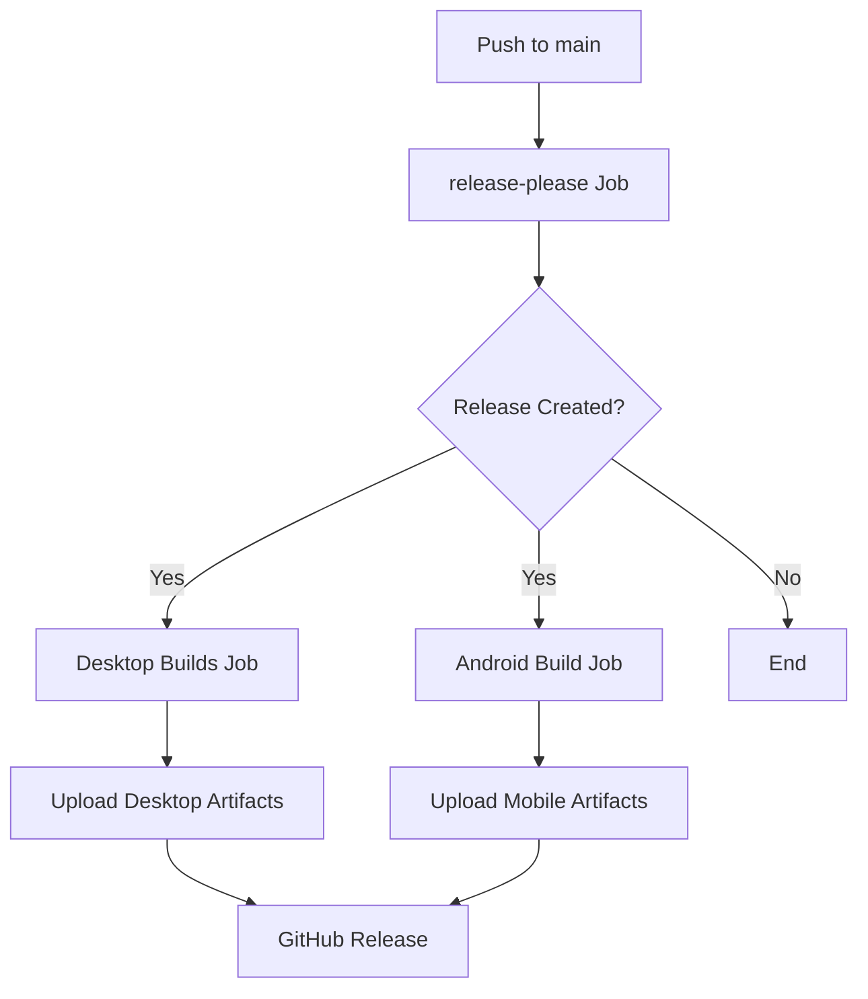

# VaultNote CI/CD Pipeline: Complete Journey & Implementation Guide

> **Status**: ✅ **FULLY WORKING** - Desktop (Windows, macOS, Linux) and Android builds successfully automated  
> **Last Updated**: September 12, 2025  
> **Purpose**: Complete documentation of CI/CD journey for VaultNote and replication guide for future projects

## Table of Contents

1. [Executive Summary](#executive-summary)
2. [Journey Overview](#journey-overview)
3. [Complete Issue Timeline](#complete-issue-timeline)
4. [Final Working Architecture](#final-working-architecture)
5. [Step-by-Step Replication Guide](#step-by-step-replication-guide)
6. [Current CI/CD Configuration](#current-cicd-configuration)
7. [Troubleshooting Guide](#troubleshooting-guide)
8. [Key Learnings & Best Practices](#key-learnings--best-practices)
9. [Technical Reference](#technical-reference)
10. [Appendix: Complete Configurations](#appendix-complete-configurations)

---

## Executive Summary

This document chronicles the complete CI/CD pipeline development for VaultNote, a Tauri-based cross-platform application with desktop and Android support. After extensive trial-and-error, research, and iteration, we achieved a fully automated build pipeline that:

### ✅ What Works Now

- **Desktop Builds**: Automated for Windows, macOS (Intel/ARM), and Linux
- **Android Builds**: Automated APK and AAB generation with proper signing
- **Version Management**: Single source of truth with automatic synchronization
- **Release Management**: Automated with release-please integration
- **Artifact Distribution**: Automatic upload to GitHub releases

### 🎯 Key Achievement

The mobile (Android) build was the most challenging aspect, requiring resolution of 6 major issue categories involving SDK setup, version management, signing, and build artifacts. The final solution eliminates manual intervention and provides clear error reporting.

### 📊 Build Statistics

- **6 Major Issue Categories Resolved**
- **8 Individual Technical Problems Solved**
- **3 CI/CD Jobs**: release-please, desktop builds, Android builds
- **4 Platform Targets**: Windows, macOS, Linux, Android
- **Multiple Architecture Support**: x86_64, aarch64 (ARM)

---

## Journey Overview

### The Challenge

VaultNote is a Tauri v2 application requiring:

- Cross-platform desktop builds (Windows, macOS, Linux)
- Android mobile builds with proper APK signing
- Automated version management across multiple files
- Integration with GitHub releases and automation

### The Path

What started as a straightforward CI/CD setup became a comprehensive learning journey through:

- Tauri v2 build system intricacies
- Android SDK and signing complexities
- Version synchronization across Node.js and Rust ecosystems
- GitHub Actions workflow optimization

### The Outcome

A robust, automated pipeline that serves as a template for future Tauri projects, complete with comprehensive documentation and troubleshooting guides.

---

## Complete Issue Timeline

### Phase 1: Foundation & Release Management (Early Issues)

**Timeline**: Initial setup  
**Focus**: Basic CI/CD infrastructure

#### Issue 1.1: Release-Please v4 Configuration

- **Problem**: Using unsupported inputs `extra-files` and `changelog-types` in v4
- **Symptoms**: Workflow failures on release creation
- **Root Cause**: GitHub Actions using outdated v3 configuration syntax
- **Solution**: Migrated to proper manifest-based configuration
  - Created `.release-please-config.json`
  - Created `.release-please-manifest.json`
  - Updated workflow to use v4 syntax

#### Issue 1.2: Branch Cleanup

- **Problem**: Stale release-please branches accumulating
- **Solution**: Added automated branch cleanup workflow

### Phase 2: Version Synchronization Crisis

**Timeline**: Mid-development  
**Focus**: Solving version management across ecosystems

#### Issue 2.1: Semver Validation Failure

- **Problem**: `Error 'package > version' must be a semver string`
- **Symptoms**: Tauri builds failing at validation stage
- **Root Cause**: Version mismatches between:
  - `package.json` (managed by release-please)
  - `src-tauri/Cargo.toml` (Rust ecosystem)
  - `src-tauri/tauri.conf.json` (Tauri configuration)

#### Issue 2.2: Race Conditions in CI

- **Problem**: Manual version updates in GitHub Actions had timing issues
- **Root Cause**: release-please changes not reflected before validation
- **Solution**: Implemented single source of truth architecture:
  - `package.json` as primary authority
  - `tauri.conf.json` → points to `"../package.json"`
  - `scripts/sync-versions.js` → automatically updates `Cargo.toml`

### Phase 3: Android SDK & Environment Setup

**Timeline**: Android implementation phase  
**Focus**: Getting Android build environment working

#### Issue 3.1: Missing Build Tools

- **Problem**: `apksigner: command not found`
- **Symptoms**: Android build failing at signing stage
- **Root Cause**: Android SDK build-tools not installed or not in PATH
- **Solution**: Enhanced SDK setup
  - Explicit `packages: "tools platform-tools build-tools;34.0.0"`
  - Manual PATH configuration for build-tools
  - Verification steps with `which apksigner`

#### Issue 3.2: Java & NDK Configuration

- **Problem**: Inconsistent Java versions and missing NDK
- **Solution**: Standardized on Java 17 with Temurin distribution
- **Additional**: Added NDK installation and environment setup

### Phase 4: Rust/NPM Version Alignment

**Timeline**: Mid-to-late development  
**Focus**: Eliminating version parsing errors

#### Issue 4.1: Invalid Semver in Cargo.toml

- **Problem**: `Failed to parse version '2' for tauri crates`
- **Symptoms**: Cargo compilation failures
- **Root Cause**: Using imprecise version specifiers like `"2"`
- **Research Method**: Used MCP tools to scrape crates.io for exact versions
- **Solution**: Updated to specific semantic versions:
  - `tauri = "2.8.5"`
  - `tauri-plugin-opener = "2.5.0"`
  - `tauri-plugin-dialog = "2.4.0"`
  - `tauri-plugin-fs = "2.4.2"`

#### Issue 4.2: NPM/Rust Version Mismatches

- **Problem**: NPM packages didn't match Rust crate versions
- **Research**: Cross-referenced npmjs.com with crates.io
- **Solution**: Aligned versions for maximum compatibility
- **Result**: Exact version matching where possible, compatible ranges where needed

### Phase 5: Android Signing & Security

**Timeline**: Late development  
**Focus**: Proper APK signing and keystore management

#### Issue 5.1: Keystore Validation Failures

- **Problem**: "Keystore file is empty or was not created"
- **Root Cause**: Invalid base64 secrets or missing GitHub secrets
- **Solution**: Implemented robust keystore validation:
  - Pre-decode validation
  - File size verification
  - Clear error messages with troubleshooting guidance

#### Issue 5.2: Manual Signing Problems

- **Problem**: Manual post-build signing causing "INSTALL_FAILED_INVALID_APK"
- **Discovery**: Tauri automatically handles signing when keystore.properties exists
- **Solution**: Removed manual `apksigner` steps, let Gradle handle signing

### Phase 6: Build Artifacts & Distribution

**Timeline**: Final implementation  
**Focus**: Proper artifact handling and upload

#### Issue 6.1: APK Path Mismatches

- **Problem**: Workflow expected `app-universal-release-unsigned.apk` (doesn't exist)
- **Reality**: Tauri produces `app-universal-release.apk` (already signed)
- **Solution**: Fixed artifact paths to match Tauri's output structure

#### Issue 6.2: AAB Handling

- **Problem**: Android App Bundle (AAB) not properly generated/uploaded
- **Solution**: Added AAB to build outputs and upload process

---

## Final Working Architecture

### High-Level Pipeline Flow



### Version Management Architecture

```
package.json (source of truth)
    ↓
tauri.conf.json ("../package.json")
    ↓
scripts/sync-versions.js
    ↓
src-tauri/Cargo.toml (auto-synced)
```

### CI/CD Job Structure

#### 1. Release-Please Job

- **Purpose**: Version management and release creation
- **Triggers**: Push to main, workflow_dispatch
- **Key Steps**:
  1. Version validation and synchronization
  2. Release-please execution
  3. Tag and release creation

#### 2. Desktop Builds Job

- **Purpose**: Multi-platform desktop application builds
- **Strategy**: Matrix build across platforms
- **Platforms**: Windows, macOS (Intel + ARM), Ubuntu
- **Key Steps**:
  1. Platform-specific dependency installation
  2. Rust toolchain setup with appropriate targets
  3. Web asset building with Vite
  4. Tauri build execution
  5. Artifact upload to release

#### 3. Android Build Job

- **Purpose**: Android APK and AAB generation
- **Platform**: Ubuntu (Android SDK)
- **Key Steps**:
  1. Android SDK and build-tools installation
  2. Keystore decoding and validation
  3. Signing configuration setup
  4. Tauri Android build
  5. Artifact verification and upload

---

## Step-by-Step Replication Guide

### Prerequisites

Before starting, ensure you have:

- A Tauri v2 project
- GitHub repository with Actions enabled
- Android keystore file for mobile builds (if needed)

### Step 1: Repository Setup

1. **Clone this configuration structure**:

   ```
   .github/workflows/
     ├── release.yml
     └── cleanup-branches.yml
   scripts/
     └── sync-versions.js
   .release-please-config.json
   .release-please-manifest.json
   ```

2. **Set up GitHub Secrets**:

   ```
   RELEASE_PLEASE_TOKEN=<GitHub PAT with repo access>

   # For Android builds:
   ANDROID_KEYSTORE=<base64 encoded keystore file>
   ANDROID_KEYSTORE_PASSWORD=<keystore password>
   ANDROID_KEY_ALIAS=<key alias>
   ANDROID_KEY_PASSWORD=<key password>

   # Application specific:
   VITE_LOGIN_URL=<your app's login URL>
   ```

3. **Generate Android Keystore** (if needed):

   ```bash
   keytool -genkey -v -keystore vaultnote-release.keystore \
     -alias vaultnote -keyalg RSA -keysize 2048 -validity 10000

   # Convert to base64 for GitHub Secret
   base64 vaultnote-release.keystore | tr -d '\n'
   ```

### Step 2: Version Management Setup

1. **Configure package.json as source of truth**:

   ```json
   {
     "name": "your-app",
     "version": "0.1.0",
     "scripts": {
       "sync-versions": "node scripts/sync-versions.js",
       "pre-commit": "bun run sync-versions"
     }
   }
   ```

2. **Update tauri.conf.json**:

   ```json
   {
     "version": "../package.json",
     "productName": "your-app"
   }
   ```

3. **Copy the sync-versions.js script** (see Appendix)

### Step 3: Release-Please Configuration

1. **Create .release-please-config.json**:

   ```json
   {
     "packages": {
       ".": {
         "release-type": "node",
         "package-name": "your-app",
         "extra-files": ["src-tauri/tauri.conf.json", "src-tauri/Cargo.toml"]
       }
     }
   }
   ```

2. **Create .release-please-manifest.json**:
   ```json
   {
     ".": "0.1.0"
   }
   ```

### Step 4: Dependency Version Alignment

1. **Research exact versions** for your Tauri dependencies:

   - Visit [crates.io](https://crates.io) for Rust crates
   - Visit [npmjs.com](https://npmjs.com) for NPM packages
   - Ensure major.minor versions match between ecosystems

2. **Update Cargo.toml with specific versions**:

   ```toml
   [dependencies]
   tauri = { version = "2.8.5", features = ["custom-protocol"] }
   tauri-plugin-opener = "2.5.0"
   tauri-plugin-dialog = "2.4.0"
   tauri-plugin-fs = "2.4.2"
   ```

3. **Update package.json with matching versions**:
   ```json
   {
     "dependencies": {
       "@tauri-apps/api": "2.8.0",
       "@tauri-apps/plugin-opener": "2.5.0",
       "@tauri-apps/plugin-dialog": "2.4.0",
       "@tauri-apps/plugin-fs": "2.4.2"
     }
   }
   ```

### Step 5: GitHub Actions Workflow

1. **Copy the release.yml workflow** (see Appendix)
2. **Customize platform matrix** if needed:
   ```yaml
   strategy:
     matrix:
       include:
         - platform: macos-latest
           args: --target aarch64-apple-darwin
         - platform: macos-latest
           args: --target x86_64-apple-darwin
         - platform: ubuntu-22.04
           args: ""
         - platform: windows-latest
           args: ""
   ```

### Step 6: Testing & Validation

1. **Local testing**:

   ```bash
   # Test version sync
   bun run sync-versions

   # Test desktop build
   bun install
   bun run build

   # Test Android build (requires Android SDK locally)
   cd src-tauri
   cargo tauri android build
   ```

2. **CI testing**:
   - Push a commit with conventional commit format
   - Verify release-please creates a PR
   - Merge PR to trigger builds
   - Check that all artifacts are created and uploaded

### Step 7: Monitoring & Maintenance

1. **Set up branch protection** on main branch
2. **Monitor build logs** for the first few releases
3. **Update dependency versions** periodically
4. **Review and update this documentation** as needed

---

## Current CI/CD Configuration

### GitHub Actions Jobs Overview

| Job             | Platform               | Purpose                              | Duration   | Artifacts                   |
| --------------- | ---------------------- | ------------------------------------ | ---------- | --------------------------- |
| release-please  | ubuntu-latest          | Version management, release creation | ~1 min     | Release notes, tags         |
| publish-tauri   | Windows, macOS, Ubuntu | Desktop application builds           | ~5-10 min  | .exe, .dmg, .deb, .AppImage |
| publish-android | ubuntu-22.04           | Android builds                       | ~10-15 min | .apk, .aab                  |

### Dependency Matrix

| Category        | Package                   | Version | Source    |
| --------------- | ------------------------- | ------- | --------- |
| **Rust Core**   | tauri                     | 2.8.5   | crates.io |
| **Build Tools** | tauri-build               | 2.4.1   | crates.io |
| **Plugins**     | tauri-plugin-opener       | 2.5.0   | crates.io |
|                 | tauri-plugin-dialog       | 2.4.0   | crates.io |
|                 | tauri-plugin-fs           | 2.4.2   | crates.io |
| **NPM Core**    | @tauri-apps/api           | 2.8.0   | npmjs.com |
| **NPM Plugins** | @tauri-apps/plugin-opener | 2.5.0   | npmjs.com |
|                 | @tauri-apps/plugin-dialog | 2.4.0   | npmjs.com |
|                 | @tauri-apps/plugin-fs     | 2.4.2   | npmjs.com |

### Build Environment Specifications

#### Desktop Builds

- **Node.js**: Bun (latest)
- **Rust**: Stable toolchain with platform targets
- **System Dependencies** (Ubuntu): libwebkit2gtk-4.1-dev, libappindicator3-dev, librsvg2-dev, patchelf

#### Android Builds

- **Java**: 17 (Temurin distribution)
- **Android SDK**: API 34
- **Build Tools**: 34.0.0
- **NDK**: 25.2.9519653
- **Rust Targets**: aarch64-linux-android, armv7-linux-androideabi, i686-linux-android, x86_64-linux-android

---

## Troubleshooting Guide

### Common Build Failures

#### 1. Version Synchronization Issues

**Symptom**: `Error 'package > version' must be a semver string`

```
Diagnosis Steps:
1. Check if all three files have matching versions:
   - package.json
   - src-tauri/Cargo.toml
   - src-tauri/tauri.conf.json (should point to ../package.json)

2. Run version sync locally:
   bun run sync-versions

3. Verify no manual version edits in CI workflow
```

**Solution**:

- Ensure `tauri.conf.json` contains `"version": "../package.json"`
- Run `node scripts/sync-versions.js` before any builds
- Check for release-please race conditions

#### 2. Android SDK Issues

**Symptom**: `apksigner: command not found`

```
Diagnosis Steps:
1. Verify build-tools installation in workflow
2. Check PATH configuration for build-tools directory
3. Run apksigner verification steps
```

**Solution**:

```yaml
- name: Setup Android SDK & NDK
  uses: android-actions/setup-android@v3
  with:
    packages: "tools platform-tools build-tools;34.0.0"

- name: Add build-tools to PATH
  run: echo "$ANDROID_SDK_ROOT/build-tools/34.0.0" >> $GITHUB_PATH
```

#### 3. Keystore Problems

**Symptom**: `Keystore file is empty or was not created`

```
Diagnosis Steps:
1. Verify ANDROID_KEYSTORE secret exists and is not empty
2. Test base64 decoding locally:
   echo "YOUR_BASE64_STRING" | base64 -d > test.keystore
3. Check keystore file validity:
   file test.keystore
```

**Solution**:

- Re-generate base64 string: `base64 your-keystore.keystore | tr -d '\n'`
- Ensure no extra whitespace in GitHub Secret
- Verify all related secrets are set (password, alias, key password)

#### 4. Build Artifact Issues

**Symptom**: APK/AAB files not found or unsigned

```
Diagnosis Steps:
1. List build output directories:
   ls -la src-tauri/gen/android/app/build/outputs/apk/universal/release/
2. Check if keystore.properties was created correctly
3. Verify Gradle signing configuration
```

**Solution**:

- Ensure keystore.properties is written to correct location
- Remove manual signing steps (let Gradle handle it)
- Fix artifact paths to match Tauri's output structure

#### 5. Dependency Version Conflicts

**Symptom**: `Failed to parse version 'X' for crate Y`

```
Diagnosis Steps:
1. Check for generic version specifiers (like "2")
2. Verify NPM and Rust versions are compatible
3. Look for version range conflicts
```

**Solution**:

- Use specific semantic versions in Cargo.toml
- Research latest compatible versions on crates.io
- Align NPM packages with Rust crate versions

### Advanced Debugging

#### Enable Verbose Logging

Add to workflow for detailed output:

```yaml
- name: Debug Build Environment
  run: |
    echo "Node.js version: $(node --version)"
    echo "Bun version: $(bun --version)"  
    echo "Rust version: $(rustc --version)"
    echo "Cargo version: $(cargo --version)"
    echo "Android SDK: $ANDROID_SDK_ROOT"
    echo "NDK: $NDK_HOME"
    ls -la src-tauri/gen/android/
```

#### Test Locally

Before pushing to CI:

```bash
# Version sync test
node scripts/sync-versions.js

# Build validation test (fast, no artifacts)
bun install
bun run vite build
cd src-tauri
cargo check  # Validates Rust code without building

# Quick build verification (debug mode, faster)
cargo tauri build --debug  # Creates debug artifacts for testing

# Full desktop build test (production artifacts)
cargo tauri build

# Android build test (requires local SDK)
cargo tauri android build
```

---

## Key Learnings & Best Practices

### Strategic Decisions

#### 1. Single Source of Truth for Versions

**Decision**: Use `package.json` as the primary version authority  
**Rationale**:

- Release-please manages Node.js ecosystem naturally
- NPM ecosystem has better tooling for version management
- Reduces complexity of multi-file synchronization

**Implementation**:

- `tauri.conf.json` → `"version": "../package.json"`
- `scripts/sync-versions.js` → auto-updates `Cargo.toml`
- CI validates parity before any builds

#### 2. Let Tauri Handle Android Signing

**Decision**: Remove manual post-build signing steps  
**Rationale**:

- Tauri's Gradle integration handles signing properly
- Manual signing often corrupts APK structure
- Automatic signing is more reliable and maintainable

**Implementation**:

- Keystore configuration via `keystore.properties`
- Gradle signing configuration in Android build
- Direct artifact upload without post-processing

#### 3. Matrix Strategy for Desktop Builds

**Decision**: Use GitHub Actions matrix for multi-platform builds  
**Benefits**:

- Parallel execution reduces total build time
- Platform-specific optimizations possible
- Easier to add/remove platforms

### Technical Best Practices

#### Version Management

✅ **Do**:

- Use specific semantic versions in dependencies
- Maintain version alignment between NPM and Rust ecosystems
- Automate version synchronization
- Validate versions before builds

❌ **Don't**:

- Use generic version specifiers like "2"
- Manually edit versions in CI workflows
- Allow version drift between ecosystems

#### Android Development

✅ **Do**:

- Use stable Java LTS versions (17)
- Install specific SDK and build-tools versions
- Validate keystore before attempting build
- Let Gradle handle APK signing

❌ **Don't**:

- Rely on default SDK installations
- Manually sign APKs after build
- Skip keystore validation steps

#### CI/CD Architecture

✅ **Do**:

- Separate concerns into focused jobs
- Use caching for dependencies and build artifacts
- Implement proper error handling and debugging
- Document all secret requirements

❌ **Don't**:

- Combine unrelated build steps in single jobs
- Skip artifact verification steps
- Use unclear or generic error messages

### Research Methods Used

#### 1. Sequential Thinking Analysis

Used MCP sequential thinking to break down complex multi-issue scenarios systematically. This helped identify root causes and plan comprehensive solutions.

#### 2. Web Research with Exa AI

Leveraged deep research capabilities to find:

- Official Tauri documentation and best practices
- Android SDK setup patterns
- Version compatibility matrices
- Community solutions to similar problems

#### 3. Documentation Scraping

Used Firecrawl to extract exact information from:

- crates.io for Rust dependency versions
- npmjs.com for NPM package versions
- Official Tauri documentation sites
- GitHub Actions marketplace for action usage

### Future-Proofing Strategies

#### Dependency Management

- Pin major versions but allow compatible minor updates
- Regularly audit for security vulnerabilities
- Test dependency updates in feature branches
- Maintain compatibility matrices

#### Documentation

- Keep troubleshooting guides updated with new issues
- Document any manual interventions or workarounds
- Maintain clear separation between working and experimental configs
- Version control all configuration changes

#### Monitoring

- Set up failure notifications for critical build paths
- Monitor build times and optimize as needed
- Track success rates across different platforms
- Regular audit of GitHub Actions usage and costs

---

## Technical Reference

### File Structure

```
VaultNote/
├── .github/workflows/
│   ├── release.yml              # Main CI/CD pipeline
│   └── cleanup-branches.yml     # Branch maintenance
├── scripts/
│   └── sync-versions.js         # Version synchronization
├── src-tauri/
│   ├── tauri.conf.json         # Points to ../package.json
│   └── Cargo.toml              # Auto-synced from package.json
├── .release-please-config.json  # Release-please configuration
├── .release-please-manifest.json # Version tracking
└── package.json                # Source of truth for versions
```

### Critical Commands

#### Local Development

```bash
# Sync versions
bun run sync-versions

# Build web assets
bun run vite build

# Quick validation (no artifacts, fast feedback)
cd src-tauri
cargo check

# Debug build (faster than release, creates test artifacts)
cargo tauri build --debug

# Full desktop build (production artifacts)
cargo tauri build

# Android build (requires SDK)
cargo tauri android build

# Check versions
node scripts/sync-versions.js
```

#### CI/CD Debugging

```bash
# In GitHub Actions workflow
node scripts/sync-versions.js
ls -la src-tauri/gen/android/app/build/outputs/
which apksigner
apksigner --version
file vaultnote-release.keystore
```

### Environment Variables

| Variable           | Purpose              | Example                                |
| ------------------ | -------------------- | -------------------------------------- |
| `ANDROID_SDK_ROOT` | Android SDK location | `/opt/android-sdk`                     |
| `NDK_HOME`         | Android NDK location | `${ANDROID_SDK_ROOT}/ndk/25.2.9519653` |
| `VITE_LOGIN_URL`   | App-specific config  | `https://api.yourapp.com/login`        |
| `GITHUB_TOKEN`     | Release uploads      | Auto-provided by Actions               |

### GitHub Secrets Required

| Secret                      | Description                   | Format        |
| --------------------------- | ----------------------------- | ------------- |
| `RELEASE_PLEASE_TOKEN`      | GitHub PAT for release-please | GitHub token  |
| `ANDROID_KEYSTORE`          | Base64 encoded keystore       | Base64 string |
| `ANDROID_KEYSTORE_PASSWORD` | Keystore password             | Plain text    |
| `ANDROID_KEY_ALIAS`         | Key alias in keystore         | Plain text    |
| `ANDROID_KEY_PASSWORD`      | Individual key password       | Plain text    |
| `VITE_LOGIN_URL`            | Application configuration     | URL string    |

---

## Appendix: Complete Configurations

### A.1: GitHub Actions Workflow (release.yml)

```yaml
name: Release & Build Tauri

on:
  push:
    branches: [main]
  workflow_dispatch:
    inputs:
      bump:
        description: "Force version bump type"
        required: false
        type: choice
        options: ["patch", "minor", "major"]

jobs:
  release-please:
    runs-on: ubuntu-latest
    permissions:
      contents: write
      pull-requests: write
    outputs:
      releases_created: ${{ steps.release.outputs.releases_created }}
      tag_name: ${{ steps.release.outputs.tag_name }}
    steps:
      - uses: actions/checkout@v4
      - name: Validate version parity
        run: |
          set -euo pipefail
          pkg=$(node -p "require('./package.json').version")
          # Run sync script to ensure Cargo.toml matches package.json
          node scripts/sync-versions.js
          # Now verify all are in sync
          cargo=$(sed -n 's/^version = "\(.*\)"/\1/p' src-tauri/Cargo.toml | head -n1)
          echo "package.json: $pkg"
          echo "src-tauri/Cargo.toml: $cargo"
          echo "src-tauri/tauri.conf.json: points to ../package.json"
          if [ "$pkg" != "$cargo" ]; then
            echo "Version mismatch detected between package.json and src-tauri/Cargo.toml"
            exit 1
          fi
      - uses: googleapis/release-please-action@v4
        id: release
        with:
          token: ${{ secrets.RELEASE_PLEASE_TOKEN }}
          config-file: .release-please-config.json
          manifest-file: .release-please-manifest.json

  publish-tauri:
    needs: release-please
    if: ${{ needs.release-please.outputs.releases_created == 'true' }}
    permissions:
      contents: write
    strategy:
      fail-fast: false
      matrix:
        include:
          - platform: macos-latest
            args: --target aarch64-apple-darwin
          - platform: macos-latest
            args: --target x86_64-apple-darwin
          - platform: ubuntu-22.04
            args: ""
          - platform: windows-latest
            args: ""
    runs-on: ${{ matrix.platform }}
    steps:
      - uses: actions/checkout@v4
        with:
          ref: ${{ needs.release-please.outputs.tag_name }}

      - name: Debug version in tauri.conf.json and Cargo.toml
        run: |
          cat src-tauri/tauri.conf.json
          cat src-tauri/Cargo.toml

      - name: Ensure versions are synchronized
        shell: bash
        run: |
          echo "Using sync-versions.js script to ensure Cargo.toml matches package.json"
          echo "Note: tauri.conf.json now uses ../package.json as version source"
          # Sync Cargo.toml with package.json version
          node scripts/sync-versions.js
          echo "Updated src-tauri/Cargo.toml:"
          sed -n '1,40p' src-tauri/Cargo.toml

      - name: Install system deps (Ubuntu)
        if: matrix.platform == 'ubuntu-22.04'
        run: |
          sudo apt-get update
          sudo apt-get install -y \
            libwebkit2gtk-4.1-dev libappindicator3-dev librsvg2-dev patchelf

      - uses: oven-sh/setup-bun@v2
        with:
          bun-version: latest

      - uses: dtolnay/rust-toolchain@stable
        with:
          targets: ${{ matrix.platform == 'macos-latest' && 'aarch64-apple-darwin,x86_64-apple-darwin' || '' }}

      - uses: swatinem/rust-cache@v2
        with:
          workspaces: ./src-tauri -> target

      - run: bun install

      - name: Build web assets
        env:
          VITE_LOGIN_URL: ${{ secrets.VITE_LOGIN_URL }}
        run: bun run vite build

      - uses: tauri-apps/tauri-action@v0
        env:
          GITHUB_TOKEN: ${{ secrets.GITHUB_TOKEN }}
          VITE_LOGIN_URL: ${{ secrets.VITE_LOGIN_URL }}
        with:
          projectPath: src-tauri
          tagName: ${{ needs.release-please.outputs.tag_name }}
          releaseName: "VaultNote ${{ needs.release-please.outputs.tag_name }}"
          releaseBody: "See the assets below to download and install."
          releaseDraft: false
          prerelease: false
          args: ${{ matrix.platform == 'macos-latest' && matrix.args || '' }}

  publish-android:
    needs: release-please
    if: ${{ needs.release-please.outputs.releases_created == 'true' }}
    runs-on: ubuntu-22.04
    permissions:
      contents: write
    steps:
      - name: Checkout release tag
        uses: actions/checkout@v4
        with:
          ref: ${{ needs.release-please.outputs.tag_name }}

      - name: Debug version in tauri.conf.json and Cargo.toml
        run: |
          cat src-tauri/tauri.conf.json
          if [ -f src-tauri/tauri.android.conf.json ]; then cat src-tauri/tauri.android.conf.json; fi
          cat src-tauri/Cargo.toml

      - name: Ensure versions are synchronized
        shell: bash
        run: |
          echo "Using sync-versions.js script to ensure Cargo.toml matches package.json"
          echo "Note: tauri.conf.json now uses ../package.json as version source"
          # Sync Cargo.toml with package.json version
          node scripts/sync-versions.js
          echo "Updated src-tauri/Cargo.toml:"
          sed -n '1,40p' src-tauri/Cargo.toml

      - name: Setup Bun
        uses: oven-sh/setup-bun@v2
        with:
          bun-version: latest

      - name: Setup Java 17
        uses: actions/setup-java@v4
        with:
          distribution: temurin
          java-version: 17

      - name: Setup Android SDK & NDK
        uses: android-actions/setup-android@v3
        with:
          packages: "tools platform-tools build-tools;34.0.0"

      - name: Install SDK / Build-tools / NDK and verify apksigner
        run: |
          sdkmanager --install "platforms;android-34" "build-tools;34.0.0" "ndk;25.2.9519653"
          # Add build-tools to PATH to ensure apksigner is available
          echo "$ANDROID_SDK_ROOT/build-tools/34.0.0" >> $GITHUB_PATH
          # Verify apksigner is available
          which apksigner || echo "apksigner not found in PATH"
          apksigner --version || echo "apksigner not executable"

      - name: Export NDK_HOME
        run: echo "NDK_HOME=$ANDROID_NDK_ROOT" >> $GITHUB_ENV

      - name: Setup Rust toolchain w/ Android targets
        uses: dtolnay/rust-toolchain@stable
        with:
          targets: aarch64-linux-android,armv7-linux-androideabi,i686-linux-android,x86_64-linux-android

      - name: Cache Rust / Android build artifacts
        uses: swatinem/rust-cache@v2
        with:
          workspaces: ./src-tauri -> target

      - name: Install Tauri CLI
        run: cargo install tauri-cli --version '^2.0'

      - name: Debug Tauri CLI version
        run: cargo tauri --version

      - name: Install JS dependencies
        run: bun install

      - name: Build web assets for Android
        env:
          VITE_LOGIN_URL: ${{ secrets.VITE_LOGIN_URL }}
        run: bun run vite build

      - name: Decode signing keystore
        shell: bash
        run: |
          set -euo pipefail
          # Check if the secret exists and is not empty
          if [ -z "${{ secrets.ANDROID_KEYSTORE }}" ]; then
            echo "Error: ANDROID_KEYSTORE secret is empty or not set."
            echo "Please ensure the ANDROID_KEYSTORE secret is configured with a base64-encoded keystore file."
            exit 1
          fi
          # Decode the keystore
          echo "${{ secrets.ANDROID_KEYSTORE }}" | base64 -d > vaultnote-release.keystore
          # Verify keystore was created and has content
          if [ ! -s vaultnote-release.keystore ]; then
            echo "Error: Keystore file is empty or was not created."
            echo "This usually means the base64 string in ANDROID_KEYSTORE secret is invalid."
            exit 1
          fi
          # Show keystore info for debugging (without revealing sensitive data)
          echo "Keystore file created successfully:"
          ls -la vaultnote-release.keystore
          file vaultnote-release.keystore

      - name: Write signing config
        shell: bash
        run: |
          cd src-tauri/gen/android
          {
            echo "storeFile=$GITHUB_WORKSPACE/vaultnote-release.keystore"
            echo "storePassword=${{ secrets.ANDROID_KEYSTORE_PASSWORD }}"
            echo "keyAlias=${{ secrets.ANDROID_KEY_ALIAS }}"
            echo "keyPassword=${{ secrets.ANDROID_KEY_PASSWORD }}"
          } > keystore.properties

      - name: Debug keystore.properties
        run: cat src-tauri/gen/android/keystore.properties

      - name: Build Android (APK & AAB)
        shell: bash
        env:
          VITE_LOGIN_URL: ${{ secrets.VITE_LOGIN_URL }}
        run: |
          cd src-tauri
          cargo tauri android build

      - name: List Android build outputs
        shell: bash
        run: |
          echo "Checking Android build outputs:"
          ls -la src-tauri/gen/android/app/build/outputs/apk/universal/release/ || echo "APK directory not found"
          ls -la src-tauri/gen/android/app/build/outputs/bundle/universalRelease/ || echo "AAB directory not found"

      - name: Upload Android APK to Release
        uses: softprops/action-gh-release@v2
        if: success()
        with:
          tag_name: ${{ needs.release-please.outputs.tag_name }}
          files: |
            src-tauri/gen/android/app/build/outputs/apk/universal/release/app-universal-release.apk

      - name: Upload Android AAB to Release
        uses: softprops/action-gh-release@v2
        if: success()
        with:
          tag_name: ${{ needs.release-please.outputs.tag_name }}
          files: |
            src-tauri/gen/android/app/build/outputs/bundle/universalRelease/app-universal-release.aab
```

### A.2: Version Sync Script (scripts/sync-versions.js)

```javascript
#!/usr/bin/env node

import fs from "fs";
import path from "path";
import { fileURLToPath } from "url";

const __filename = fileURLToPath(import.meta.url);
const __dirname = path.dirname(__filename);

function syncVersions() {
  try {
    // Read package.json version
    const packageJsonPath = path.join(__dirname, "../package.json");
    const packageJson = JSON.parse(fs.readFileSync(packageJsonPath, "utf8"));
    const version = packageJson.version;

    console.log(`📦 Package.json version: ${version}`);

    // Update Cargo.toml
    const cargoTomlPath = path.join(__dirname, "../src-tauri/Cargo.toml");
    let cargoContent = fs.readFileSync(cargoTomlPath, "utf8");

    // Replace version in [package] section (only first occurrence)
    const versionRegex = /^version = ".*"/m;
    const newCargoContent = cargoContent.replace(
      versionRegex,
      `version = "${version}"`
    );

    if (cargoContent !== newCargoContent) {
      fs.writeFileSync(cargoTomlPath, newCargoContent, "utf8");
      console.log(`🦀 Updated Cargo.toml to version: ${version}`);
    } else {
      console.log(`🦀 Cargo.toml already at version: ${version}`);
    }

    // Verify tauri.conf.json points to package.json
    const tauriConfigPath = path.join(
      __dirname,
      "../src-tauri/tauri.conf.json"
    );
    const tauriConfig = JSON.parse(fs.readFileSync(tauriConfigPath, "utf8"));

    if (tauriConfig.version === "../package.json") {
      console.log("⚙️  Tauri config correctly points to package.json");
    } else {
      console.log(
        `⚠️  Warning: tauri.conf.json version is "${tauriConfig.version}" instead of "../package.json"`
      );
    }

    console.log("✅ Version sync complete!");
  } catch (error) {
    console.error("❌ Error syncing versions:", error.message);
    process.exit(1);
  }
}

if (import.meta.url === `file://${process.argv[1]}`) {
  syncVersions();
}

export { syncVersions };
```

### A.3: Release-Please Configuration (.release-please-config.json)

```json
{
  "packages": {
    ".": {
      "release-type": "node",
      "package-name": "vaultnote",
      "changelog-sections": [
        { "type": "feat", "section": "Features", "hidden": false },
        { "type": "fix", "section": "Bug Fixes", "hidden": false },
        {
          "type": "perf",
          "section": "Performance Improvements",
          "hidden": false
        },
        { "type": "deps", "section": "Dependencies", "hidden": false },
        {
          "type": "BREAKING CHANGE",
          "section": "⚠ BREAKING CHANGES",
          "hidden": false
        }
      ],
      "extra-files": ["src-tauri/tauri.conf.json", "src-tauri/Cargo.toml"]
    }
  },
  "pull-request-title-pattern": "chore: release ${version}",
  "pull-request-header": "# VaultNote Release",
  "separate-pull-requests": false,
  "skip-github-release": false,
  "include-v-in-tag": true
}
```

### A.4: Branch Cleanup Workflow (.github/workflows/cleanup-branches.yml)

```yaml
name: 🧹 Clean-up merged release-please branch

on:
  push:
    branches: [main]

jobs:
  delete-release-please-branch:
    runs-on: ubuntu-latest
    permissions:
      contents: write # required to delete refs
    steps:
      - name: Delete branch
        uses: actions/github-script@v7
        with:
          github-token: ${{ secrets.GITHUB_TOKEN }}
          script: |
            const branchName = 'release-please--branches--main';
            try {
              await github.rest.git.deleteRef({
                owner: context.repo.owner,
                repo: context.repo.repo,
                ref: `heads/${branchName}`
              });
              console.log(`✅ Deleted branch: ${branchName}`);
            } catch (err) {
              console.log(`ℹ️  Branch ${branchName} already gone or protected: ${err.message}`);
            }
```

---

## Conclusion

This comprehensive guide represents the complete journey from initial CI/CD setup challenges to a fully functional, automated build pipeline for VaultNote. The lessons learned, configurations, and troubleshooting guides contained within should enable anyone to replicate this setup without the extensive trial-and-error phase we experienced.

### Key Takeaways

1. **Version management is critical** - Single source of truth prevents most build failures
2. **Android builds are complex** - SDK setup, signing, and artifact handling require careful attention
3. **Documentation saves time** - Comprehensive troubleshooting guides prevent repeated issues
4. **Testing locally first** - Many CI issues can be caught with local testing

### Next Steps

- Monitor build performance and optimize as needed
- Keep dependency versions updated and compatible
- Expand platform support as needed (iOS, other architectures)
- Continue refining documentation based on new issues or improvements

**Last Updated**: September 12, 2025  
**Status**: ✅ Production Ready  
**Maintainer**: VaultNote Development Team
