# VaultNote Release Workflow Analysis & Flow Diagrams

> **Purpose**: Complete analysis of the release.yml workflow and its interaction with supporting workflows and scripts  
> **Last Updated**: September 12, 2025  
> **Status**: Production Implementation Analysis

## Table of Contents

1. [Workflow Architecture Overview](#workflow-architecture-overview)
2. [release.yml Detailed Analysis](#releaseyml-detailed-analysis)
3. [Flow Diagrams](#flow-diagrams)
4. [Integration Points](#integration-points)
5. [Decision Trees & Rationale](#decision-trees--rationale)
6. [Error Handling & Recovery](#error-handling--recovery)
7. [Performance & Optimization](#performance--optimization)

---

## Workflow Architecture Overview

### High-Level System Architecture

VaultNote's release system consists of **two parallel workflows** and **multiple supporting components**:

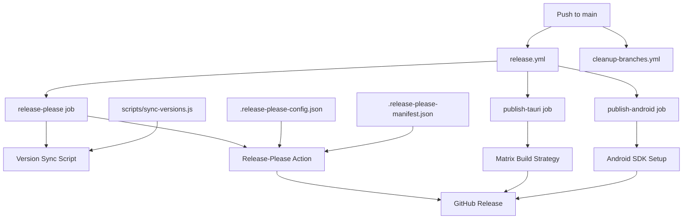

### Component Interaction Map

| Component                         | Type                    | Purpose                 | Interacts With                    |
| --------------------------------- | ----------------------- | ----------------------- | --------------------------------- |
| **release.yml**                   | GitHub Actions Workflow | Main release pipeline   | All components                    |
| **cleanup-branches.yml**          | GitHub Actions Workflow | Branch maintenance      | GitHub API                        |
| **sync-versions.js**              | Node.js Script          | Version synchronization | package.json, Cargo.toml          |
| **.release-please-config.json**   | Configuration           | Release-please settings | release-please action             |
| **.release-please-manifest.json** | State tracking          | Version state           | release-please action             |
| **package.json**                  | Source of truth         | Version authority       | sync-versions.js, tauri.conf.json |

---

## release.yml Detailed Analysis

### Workflow Structure

The `release.yml` workflow is architected as a **3-stage pipeline** with **conditional execution**:

```yaml
Triggers → release-please → [publish-tauri + publish-android] → Artifacts
```

### Job Breakdown

#### 1. **release-please Job** (The Orchestrator)

**Purpose**: Version management and release decision making  
**Runtime**: ~1 minute  
**Dependencies**: None (entry point)

```mermaid
flowchart TD
    A[Checkout Code] --> B[Validate Version Parity]
    B --> C[Run sync-versions.js]
    C --> D{Versions Match?}
    D -->|Yes| E[❌ Fail with Error]
    D -->|No| F[Run release-please Action]
    F --> G{Should Create Release?}
    G -->|No| H[✅ End - No Release Needed]
    G -->|Yes| I[📝 Create Release + Tag]
    I --> J[🎯 Output: releases_created=true]
    J --> K[🏷️ Output: tag_name]
```

**Key Steps Explained**:

1. **Version Validation**:

   ```bash
   pkg=$(node -p "require('./package.json').version")
   node scripts/sync-versions.js  # Ensure sync
   cargo=$(sed -n 's/^version = "\(.*\)"/\1/p' src-tauri/Cargo.toml | head -n1)
   ```

   - Reads version from package.json
   - Ensures Cargo.toml is synchronized
   - Fails fast if versions don't match

2. **Release-Please Decision**:

   - Analyzes commit history since last release
   - Follows conventional commit patterns (feat:, fix:, etc.)
   - Creates release only if changes warrant it

3. **Outputs**:
   - `releases_created`: Boolean flag for downstream jobs
   - `tag_name`: Git tag for artifact labeling

#### 2. **publish-tauri Job** (Multi-Platform Builder)

**Purpose**: Desktop application builds across platforms  
**Runtime**: 5-10 minutes per platform (parallel)  
**Dependencies**: `needs: release-please` + `if: releases_created == 'true'`

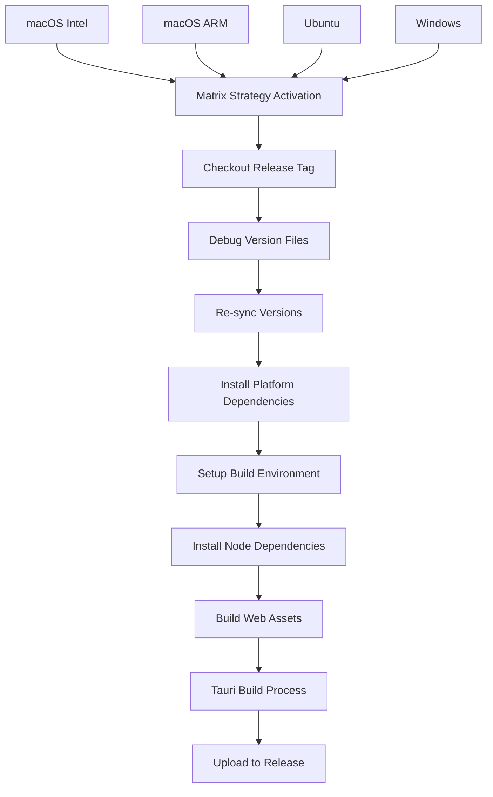

**Matrix Strategy**:

```yaml
strategy:
  fail-fast: false
  matrix:
    include:
      - platform: macos-latest
        args: --target aarch64-apple-darwin
      - platform: macos-latest
        args: --target x86_64-apple-darwin
      - platform: ubuntu-22.04
        args: ""
      - platform: windows-latest
        args: ""
```

**Key Steps Explained**:

1. **Platform-Specific Setup**:

   - Ubuntu: Installs WebKit and system libraries
   - macOS: Sets up both Intel and ARM targets
   - Windows: Uses default Windows runner environment

2. **Build Process**:

   ```bash
   bun install                    # Node dependencies
   bun run vite build            # Web assets
   tauri-action@v0               # Native builds + upload
   ```

3. **Artifact Generation**:
   - **Windows**: `.exe`, `.msi`
   - **macOS**: `.dmg`, `.app`
   - **Linux**: `.deb`, `.AppImage`

#### 3. **publish-android Job** (Mobile Builder)

**Purpose**: Android APK and AAB generation  
**Runtime**: 10-15 minutes  
**Dependencies**: `needs: release-please` + `if: releases_created == 'true'`

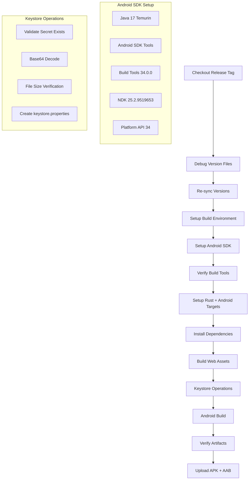

**Key Steps Explained**:

1. **Android Environment Setup**:

   ```yaml
   - Java 17 (Temurin distribution)
   - Android SDK with specific components
   - NDK for native compilation
   - Rust Android targets
   ```

2. **Keystore Security Flow**:

   ```bash
   # Validation
   if [ -z "$ANDROID_KEYSTORE" ]; then exit 1; fi

   # Decode
   echo "$ANDROID_KEYSTORE" | base64 -d > keystore

   # Verify
   if [ ! -s keystore ]; then exit 1; fi

   # Configure
   echo "storeFile=..." > keystore.properties
   ```

3. **Build & Artifact Generation**:
   - Creates signed APK for direct installation
   - Creates signed AAB for Play Store distribution
   - Automatic signing via Gradle integration

---

## Flow Diagrams

### 1. Complete Release Pipeline Flow

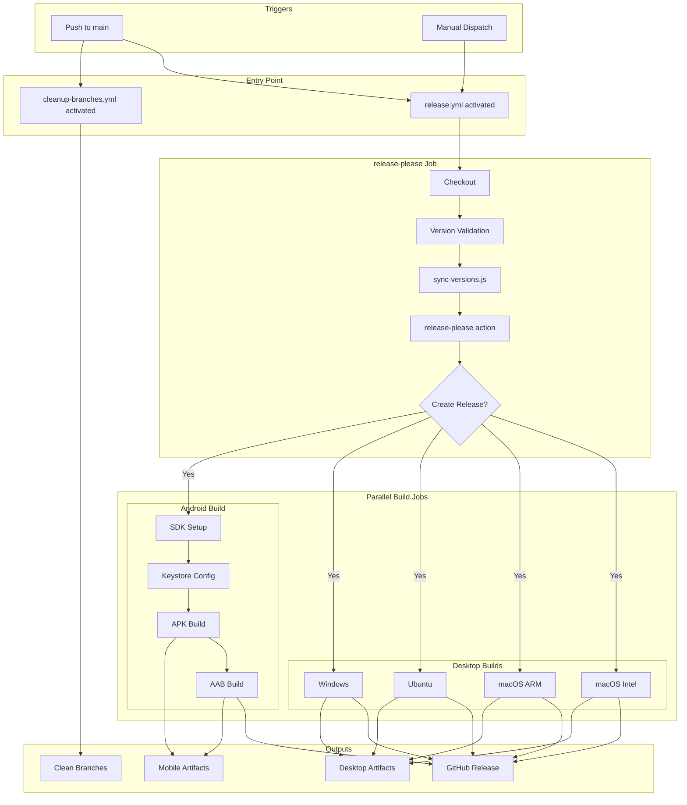

### 2. Version Management Flow

```mermaid
flowchart TD
    subgraph "Source Files"
        S1[package.json - SOURCE OF TRUTH]
        S2[src-tauri/Cargo.toml]
        S3[src-tauri/tauri.conf.json]
    end

    subgraph "Sync Process"
        P1[sync-versions.js execution]
        P2{Versions match?}
        P3[Update Cargo.toml]
        P4[Validate tauri.conf.json points to ../package.json]
    end

    subgraph "CI Validation"
        V1[Read package.json version]
        V2[Check Cargo.toml version]
        V3{Match?}
        V4[✅ Continue Pipeline]
        V5[❌ Fail with Error]
    end

    S1 --> P1
    S2 --> P1
    S3 --> P1

    P1 --> P2
    P2 -->|No| P3
    P2 -->|Yes| P4
    P3 --> P4

    P4 --> V1
    V1 --> V2
    V2 --> V3
    V3 -->|Yes| V4
    V3 -->|No| V5
```

### 3. Android Build Security Flow

```mermaid
flowchart TD
    subgraph "GitHub Secrets"
        G1[ANDROID_KEYSTORE - base64]
        G2[ANDROID_KEYSTORE_PASSWORD]
        G3[ANDROID_KEY_ALIAS]
        G4[ANDROID_KEY_PASSWORD]
    end

    subgraph "Validation Phase"
        V1{Secret exists?}
        V2[Decode base64]
        V3{File created?}
        V4{File has content?}
        V5[❌ Fail with clear error]
    end

    subgraph "Configuration Phase"
        C1[Create keystore.properties]
        C2[Set file permissions]
        C3[Write Gradle config]
    end

    subgraph "Build Phase"
        B1[cargo tauri android build]
        B2[Gradle picks up keystore.properties]
        B3[Automatic signing during build]
        B4[Generate signed APK/AAB]
    end

    G1 --> V1
    V1 -->|No| V5
    V1 -->|Yes| V2
    V2 --> V3
    V3 -->|No| V5
    V3 -->|Yes| V4
    V4 -->|No| V5
    V4 -->|Yes| C1

    G2 --> C1
    G3 --> C1
    G4 --> C1

    C1 --> C2
    C2 --> C3
    C3 --> B1
    B1 --> B2
    B2 --> B3
    B3 --> B4
```

---

## Integration Points

### 1. **Cross-Workflow Interactions**

| Workflow               | Triggers             | Interacts With       | Purpose               |
| ---------------------- | -------------------- | -------------------- | --------------------- |
| `release.yml`          | Push to main, Manual | All scripts, configs | Main release pipeline |
| `cleanup-branches.yml` | Push to main         | GitHub API           | Branch maintenance    |

**Timing Coordination**:

- Both workflows trigger on `push to main`
- They run in parallel (independent)
- `cleanup-branches.yml` cleans up after release-please branch merges

### 2. **Script Integration Points**

#### sync-versions.js Integration

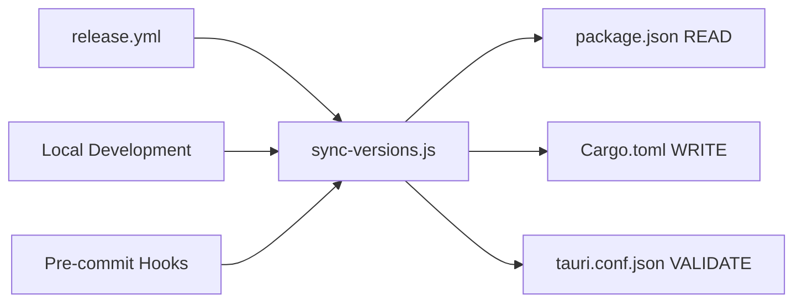

**Integration Context**:

- **CI Integration**: Called in both `release-please` and build jobs
- **Local Integration**: Available as npm script `bun run sync-versions`
- **Pre-commit Integration**: Can be hooked into git workflows

#### Release-Please Configuration Integration

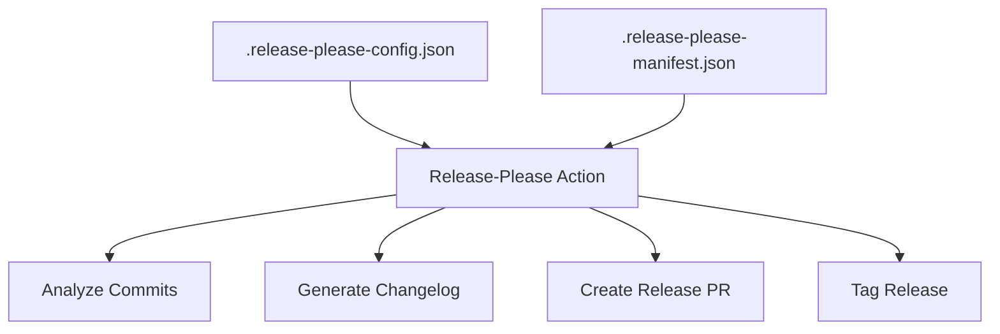

### 3. **Artifact Flow Integration**

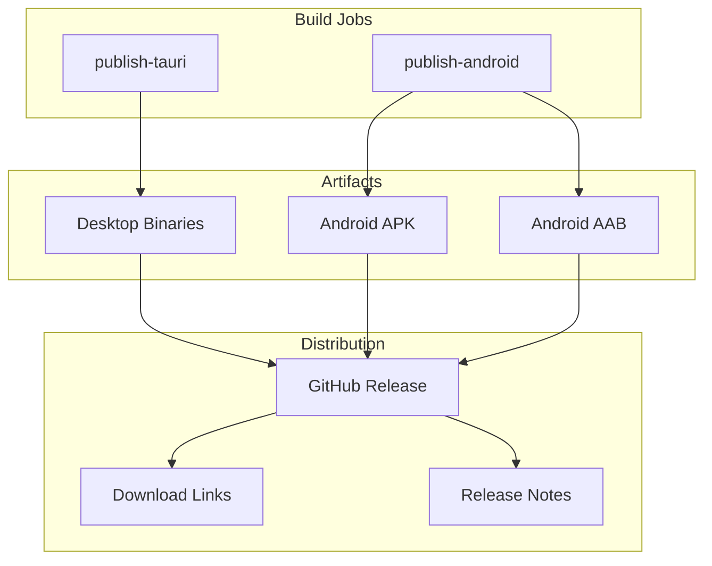

---

## Decision Trees & Rationale

### 1. **Why 3 Separate Jobs?**

```mermaid
flowchart TD
    A[Design Decision: Job Structure] --> B{Single Job vs Multiple Jobs}

    B --> C[Single Job Approach]
    B --> D[Multiple Job Approach ✅]

    C --> C1[❌ Sequential execution]
    C --> C2[❌ All-or-nothing failure]
    C --> C3[❌ Harder to debug]
    C --> C4[❌ Resource waste]

    D --> D1[✅ Parallel execution]
    D --> D2[✅ Independent failure handling]
    D --> D3[✅ Easier debugging]
    D --> D4[✅ Resource optimization]
    D --> D5[✅ Conditional execution]
```

**Rationale**:

- **Parallel Execution**: Desktop builds run simultaneously across platforms
- **Failure Isolation**: Android build failure doesn't block desktop builds
- **Resource Optimization**: Each job gets dedicated runner resources
- **Conditional Logic**: Builds only run when release is created

### 2. **Why Matrix Strategy for Desktop?**

```mermaid
flowchart TD
    A[Platform Build Strategy] --> B{Matrix vs Individual Jobs}

    B --> C[Individual Jobs]
    B --> D[Matrix Strategy ✅]

    C --> C1[❌ 4 separate job definitions]
    C --> C2[❌ Code duplication]
    C --> C3[❌ Maintenance overhead]

    D --> D1[✅ Single job definition]
    D --> D2[✅ DRY principle]
    D --> D3[✅ Easy to add platforms]
    D --> D4[✅ Consistent behavior]
```

**Implementation Benefits**:

- **Scalability**: Easy to add new platforms or architectures
- **Maintainability**: Single source of truth for build steps
- **Consistency**: All platforms follow identical build process

### 3. **Why Version Sync Script?**

```mermaid
flowchart TD
    A[Version Management Strategy] --> B{Manual vs Automated}

    B --> C[Manual Updates]
    B --> D[Automated Sync ✅]

    C --> C1[❌ Human error prone]
    C --> C2[❌ Race conditions]
    C --> C3[❌ Maintenance burden]
    C --> C4[❌ CI complexity]

    D --> D1[✅ Single source of truth]
    D --> D2[✅ Automatic synchronization]
    D --> D3[✅ Early failure detection]
    D --> D4[✅ Local + CI integration]
```

---

## Error Handling & Recovery

### 1. **Failure Points & Recovery**

| Stage                | Potential Failure         | Detection            | Recovery Strategy                  |
| -------------------- | ------------------------- | -------------------- | ---------------------------------- |
| **Version Sync**     | Version mismatch          | Pre-build validation | Clear error message, manual fix    |
| **Release Decision** | No changes to release     | Commit analysis      | Graceful exit, no builds triggered |
| **Desktop Build**    | Platform-specific failure | Per-platform job     | Other platforms continue           |
| **Android Build**    | SDK/keystore issues       | Validation steps     | Clear error messages, debug info   |
| **Artifact Upload**  | Network/permission issues | Upload step failure  | Retry logic in actions             |

### 2. **Error Handling Flow**

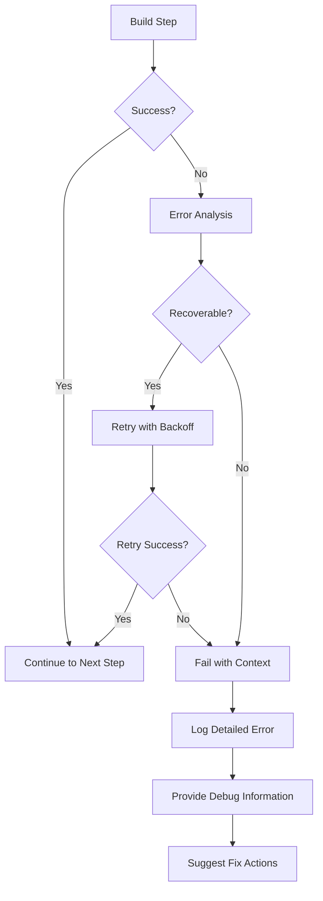

### 3. **Debugging Information Strategy**

```yaml
# Example debugging steps in workflow
- name: Debug version in tauri.conf.json and Cargo.toml
  run: |
    cat src-tauri/tauri.conf.json
    cat src-tauri/Cargo.toml

- name: List Android build outputs
  run: |
    echo "Checking Android build outputs:"
    ls -la src-tauri/gen/android/app/build/outputs/apk/universal/release/
```

**Debug Information Provided**:

- **File Contents**: Show configuration files
- **Directory Listings**: Verify expected files exist
- **Version Information**: Display tool versions
- **Environment Variables**: Show build environment state

---

## Performance & Optimization

### 1. **Build Time Optimization**

| Optimization              | Implementation         | Time Saved                | Trade-offs     |
| ------------------------- | ---------------------- | ------------------------- | -------------- |
| **Parallel Builds**       | Matrix strategy        | ~15-20 min                | Resource usage |
| **Caching**               | rust-cache@v2          | ~5-10 min                 | Storage usage  |
| **Conditional Execution** | `if: releases_created` | Avoids unnecessary builds | Complexity     |
| **Fail-Fast Disabled**    | `fail-fast: false`     | Continues other builds    | Resource usage |

### 2. **Performance Monitoring Points**

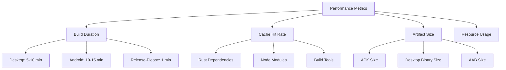

### 3. **Optimization Opportunities**

1. **Build Artifact Caching**: Cache compiled assets between builds
2. **Docker Builds**: Consistent environment, faster Android setup
3. **Build Matrix Reduction**: Target specific architectures based on usage
4. **Incremental Builds**: Only rebuild changed components

---

## Summary

### **Workflow Characteristics**

| Aspect              | Description                                      |
| ------------------- | ------------------------------------------------ |
| **Architecture**    | 3-job pipeline with conditional execution        |
| **Parallelization** | Desktop builds run in parallel matrix            |
| **Dependencies**    | Clear job dependencies with conditional triggers |
| **Security**        | Secure keystore handling with validation         |
| **Debugging**       | Comprehensive debug information at each step     |
| **Maintenance**     | Automated branch cleanup and version sync        |

### **Key Success Factors**

1. **Single Source of Truth**: package.json drives all version management
2. **Early Validation**: Version sync and validation before expensive builds
3. **Parallel Execution**: Maximum throughput with independent failure handling
4. **Security First**: Robust keystore validation and error handling
5. **Developer Experience**: Clear error messages and debugging information

### **Integration Excellence**

- **Scripts**: Seamless integration with sync-versions.js
- **Configurations**: Clean separation of concerns with config files
- **Workflows**: Parallel execution with proper cleanup
- **Security**: Secure secret handling with validation
- **Debugging**: Comprehensive logging and error reporting

This analysis demonstrates a mature, production-ready CI/CD pipeline that balances speed, security, maintainability, and developer experience.

---

**Last Updated**: September 12, 2025  
**Status**: ✅ Production Analysis Complete  
**Maintainer**: VaultNote Development Team
